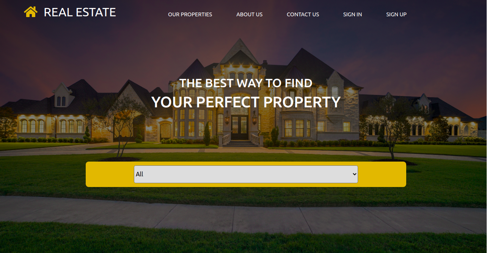

# Real Estate Client

A react app that consumes [real-estate-api](https://github.com/wathigo/Real-Estate-API). The app displays categories and properties fetched from the API. It also allows a user to get authenticated and perform actions that communicates to protected endpoints, such as add to favourites feature.

The live version can be found [here](https://real-estate-client.netlify.app).

## :package: Built With

    - React.js
    - Redux
    - rails API

## :computer: Getting Started

    To get a local copy up and running follow these simple steps.

## :arrow_heading_down: Install

1) Clone the repository to your local machine
```sh
$ git clone https://github.com/wathigo/Real-Estate-Client.git
```

2) cd into the directory
```sh
$ cd Real-Estate-Client
```

3) install dependencies 
```sh
npm install
```
or if you are using yarn:
```sh
yarn install
```

Start the development server
```sh
npm start
```
or with yarn:
```sh
yarn start
```

## :arrow_forward: Usage

You will be redirected to `localhost:3000` after starting the development server.
After this, you will get to the home page of the applications containing unfiltered world covid-19 statists.
<p align="center">
<a href="#">
    
  </a>
</p>

## :vertical_traffic_light: Testing
Tests for the endpoint have already been included [real-estate-api](https://github.com/wathigo/Real-Estate-API)
TODO: Test for the front end logic

## Potential Features
Add an admin page where admins can create, edit, or delete properties. This is an issue opened [here]([here](../../issues/5))

## :busts_in_silhouette: Authors

👤 **Simon Wathigo**

- Linkedin: [Simon Wathigo](https://www.linkedin.com/in/simon-wathigo/)
- Github: [@wathigo](https://github.com/wathigo)

## 🤝 Contributing

    Contributions, issues and feature requests are welcome!

Feel free to check the [issues page](../../issues).

## :star2: Show your support

    Give a ⭐️ if you like this project!

